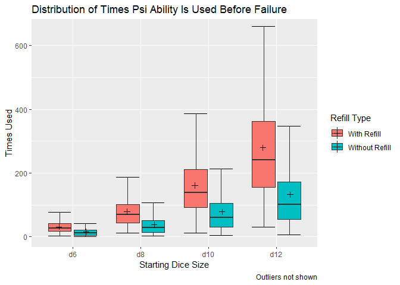

<style>
  body {
    text-align: justify;
    text-size: 12;
  }
</style>


### Background

[Dungeons & Dragons](https://www.dndbeyond.com) is a cooperative role-playing game that allows players to enter the story of a wide variety of heroes and villains. The game's designers try to bring fresh and exciting content to the game on a consistent basis through playtest material called the Unearthed Arcana. One new mechanic that was introduced to the game is the *Psionic Talent* feature. This feature allows a player to use special psionic abilities based on a roll of a four sided (d4), six sided (d6), eight sided (d8), ten sided (d10), or twelve sided (d12) die. If the player rolls the maximum or minimum value for the die, then the die increases or decreases a size respectively. 

The subtext for the feature reads:

**"If you roll the highest number on your Psionic Talent die, it decreases by one die size after the roll...If it's a d4 and you roll a 4, it becomes unusable until you finish a long rest. Conversely, if you roll a 1 on your Psionic Talent die, it increases by one die size after the roll, up to its starting size."**

This ability can be replenished back to its starting position once per long rest with the *Psi Replenishment* ability, as it reads:

**"As a bonus action, you can...restore your Psionic Talent die to its starting size. You then can't use Psi Replenishment again until you finish a long rest."**

This presents an interesting problem in determining just how useful the Psionic Talent ability is. Does this ability provide more uses statistically to players than a simple recharge mechanic such as what has been included in previous editions? 

### Methodology

To create suitable test data, a Java program was created that would test the scenario multiple times. Each time the dice was rolled according to its starting size was considered. The main observation was a unit of 1000 rolls until the feature was no longer available, per the rules described above. The amount of rolls accumulated before failure was the final data point. The amount of times that the dice increased or decreased was considered as well, and the option to refill before failure. 1000 of these 1000 roll tests were ran for each starting die size and the results were stored in a csv file, which was later analyzed and compiled.

### Distribution Visualization

In the below visualization, the distribution of runs before failure for each corresponding die size based on the availability of refills is shown. The **X** represents the mean of the factor at that level.


```r
dat %>% 
  ggplot(aes(x = fct_reorder(dSize, as.numeric(startDice)), y = runs, fill = refillBool)) + 
  stat_boxplot(geom = "errorbar") + 
  geom_boxplot(outlier.shape = NA) +
    geom_point(mapping = aes(x = fct_reorder(dSize, startDice),
                           y = avg,
                           group = refillBool), 
             data = averageDat,
             position = position_dodge(width = .8),
             size = 2,
             shape = 3) +
  labs(title = "Distribution of Times Psi Ability Is Used Before Failure",
       x = "Starting Dice Size",
       y = "Times Used",
       caption = "Outliers not shown",
       fill = "Refill Type")+
  coord_cartesian(ylim = c(0, 650))
```

<!-- -->

Even from the beginning, this feature provides sufficient use to the player. With a refill available, a low level player, the average is $\mu = 30.81$ while the median is $26$. As the die size increases the median total use before failure almost doubles with each die size. Even at the d8 starting die size, the player has almost unlimited uses because he/she is unlikely to use it as many times as would be required before final failure occurs.

However, this is all assuming that the player has the *Psi Replenishment* ability available. If the player has already expended that ability then the total use before failure is essentially cut in half. Even so, once the d10 threshold is crossed the player is unlikely to even need to use *Psi Replenishment* because the median use before failure is still extraordinarily high.

### Summary Tables

To see the data summarization in full, look at the tables below. These tables provide a quick summary of the distribution of runs given a particular scenario.


```r
dat %>% 
  filter(refillBool == "With Refill") %>% 
  select(runs, dSize) %>% 
  favstats(runs ~ dSize, data = .) %>% 
  arrange(mean) %>%
  mutate(sd = round(sd, 2),
         mean = round(mean, 2)) %>%
  select(-c("missing", "n")) %>% 
  pander(., caption = "Summary w/ Refill Available")
```


-----------------------------------------------------------
 dSize   min   Q1    median    Q3     max    mean     sd   
------- ----- ----- -------- ------- ------ ------- -------
  d6      3    17      26      41     138    30.81   19.61 

  d8     11    43      69      101    353    79.04   49.29 

  d10    12    91    137.5     211    815    161.1   100.1 

  d12    30    155    240     361.2   1000   279.2   169.7 
-----------------------------------------------------------

Table: Summary w/ Refill Available

```r
dat %>% 
  filter(refillBool == "Without Refill") %>% 
  select(runs, dSize) %>% 
  favstats(runs ~ dSize, data = .) %>% 
  arrange(mean) %>%
  mutate(sd = round(sd, 2),
         mean = round(mean, 2)) %>%
  select(-c("missing", "n")) %>% 
  pander(., caption = "Summary wo/ Refill Available")
```


---------------------------------------------------------
 dSize   min   Q1   median    Q3     max   mean     sd   
------- ----- ---- -------- ------- ----- ------- -------
  d6      1    5      11      20     92    15.02   13.81 

  d8      2    14     28     51.25   318   37.91   33.3  

  d10     4    30    59.5     104    492   78.18   66.43 

  d12     6    54    102      172    821    132     111  
---------------------------------------------------------

Table: Summary wo/ Refill Available

### Conclusion

The *Psionic Talent* subclass feature provides ample use to its users. While the median runs before failure for the lower levels of the game is somewhat low, the *Psi Replenishment* ability allows players to overcome this difficulty. In the upper stages of the game the players have nearly unlimited uses before total failure. 

### Appendix

#### Unearthed Arcana Source

[Unearthed Arcana Release](https://media.wizards.com/2020/dnd/downloads/UA2020_PsionicOptions.pdf)

#### Java Program for Test Data

```
package com.company;
import java.io.*;
import java.io.File;

public class Main {

    public static void main(String[] args) {
        // write your code here
        String startDice;
        String runs;
        String increasedCount;
        String decreasedCount;
        Integer[] startindDice = {6, 8, 10, 12};
        Integer runsPerTest = 1000;
        Integer tests = 1000;
        Integer[] results;
        Integer refill;

        try {
            for (int i = 0; i < tests; i++) {
                for (Integer dice : startindDice) {
                    refill = 1;
                    TestPsi testPsi = new TestPsi(dice, runsPerTest, refill);
                    testPsi.compute();
                    results = testPsi.getResults();
                    startDice = results[0].toString();
                    runs = results[1].toString();
                    increasedCount = results[2].toString();
                    decreasedCount = results[3].toString();
                    try {
                        File file = new File("C:\\Users\\jhok2013\\Documents\\PsiTest\\data.csv");
                        FileWriter fileWriter = new FileWriter(file, true);
                        BufferedWriter bufferedWriter = new BufferedWriter(fileWriter);
                        bufferedWriter.write(startDice + "," + runs + "," + increasedCount + "," + decreasedCount + "," + refill + "\n");
                        bufferedWriter.close();
                    } catch (IOException e) {
                        e.printStackTrace();
                    }
                }
            }
        } catch (Exception e) {
            e.printStackTrace();
        }
        try {
            for (int i = 0; i < tests; i++) {
                for (Integer dice : startindDice) {
                    refill = 0;
                    TestPsi testPsi = new TestPsi(dice, runsPerTest, refill);
                    testPsi.compute();
                    results = testPsi.getResults();
                    startDice = results[0].toString();
                    runs = results[1].toString();
                    increasedCount = results[2].toString();
                    decreasedCount = results[3].toString();
                    try {
                        File file = new File("C:\\Users\\jhok2013\\Documents\\PsiTest\\data.csv");
                        FileWriter fileWriter = new FileWriter(file, true);
                        BufferedWriter bufferedWriter = new BufferedWriter(fileWriter);
                        bufferedWriter.write(startDice + "," + runs + "," + increasedCount + "," + decreasedCount + "," + refill + "\n");
                        bufferedWriter.close();
                    } catch (IOException e) {
                        e.printStackTrace();
                    }
                }
            }
        } catch (Exception e) {
            e.printStackTrace();
        }
    }
}

```
```
package com.company;

import java.util.Random;

public class Roller {
    public Integer roller(Integer max) {
        Integer result;
        Random random = new Random();
        result = random.nextInt(max) + 1;
        return result;
    }
}
```
```
package com.company;

public class TestPsi {
    private Integer min = 4;
    private Integer max = 12;
    private Roller roller = new Roller();
    private Integer roll = 0;
    private Integer incDec = 2;
    private Integer increaseCount = 0;
    private Integer decreaseCount = 0;
    private Integer startMax;
    private Integer runs;
    private Integer i = 0;
    private Integer runMax;
    private Integer[] results;
    private Integer refill;

    public TestPsi(){
        this.startMax = 6;
        this.runs = 100;
        this.refill = 0;
    }

    public TestPsi(Integer startDice, Integer runsPerTest, Integer refillDice){
        this.startMax = startDice;
        this.runs = runsPerTest;
        this.refill = refillDice;
    }

    public void compute(){
        runMax = startMax;
        for (i = 0; i < runs; i++){
            roll = roller.roller(runMax);
            if(roll == runMax && runMax == min && roll == min && refill == 1){
                decreaseCount++;
                refill--;
                runMax = startMax;
            } else if (roll == runMax && runMax == min && roll == min && refill == 0) {
                decreaseCount++;
                break;
            } else if (roll == runMax && roll != min){
                decreaseCount++;
                runMax = runMax - incDec;
            }
            if (roll == 1 && runMax < startMax){
                increaseCount++;
                runMax = runMax + incDec;
            }
        }
    }

    public Integer[] getResults(){
        results = new Integer[]{startMax, i, increaseCount, decreaseCount, refill};
        return results;
    }
}
```
